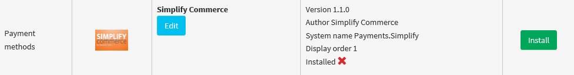
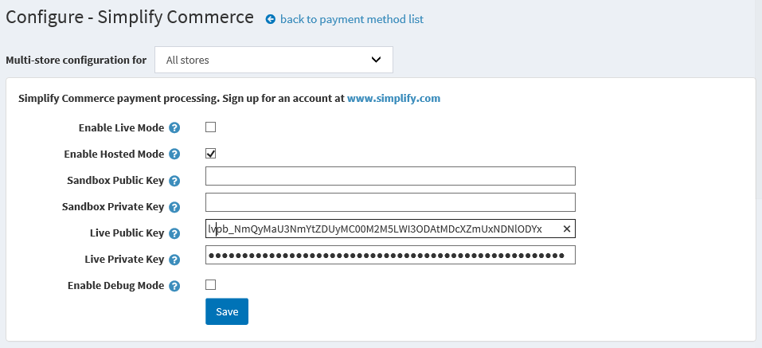
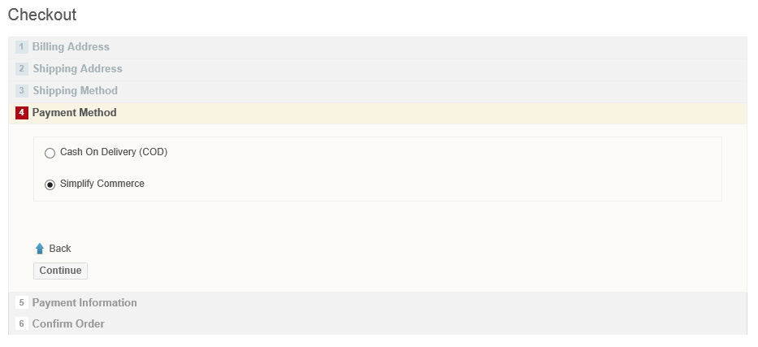
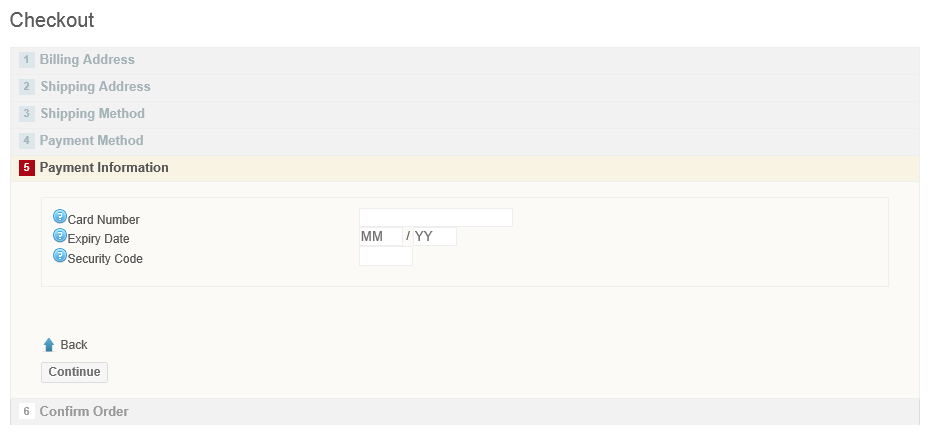

 
Simplify Commerce payment plugin for nopCommerce
================================================

The Simplify Payment payment plugin for nopCommerce is a payment method for the [nopCommerce] .Net open source shopping cart solution using [Simplify Commerce] to provice secure 
card payments.  The plugin uses card tokenization so your site never sees customer card details.  Full and partial refunds are also supported.

Installation
------------

* Using the link http://www.nopcommerce.com/p/1213/simplify-commerce-payment-module.aspx download the plugin from the [nopCommerce] site.

* Extract the contents of the ZIP file and copy the `Payments.Simplify` folder to the nopCommerce `Plugins` folder on your nopCommerce website.

* On the nopCommerce Admin panel go to `Configuration > Plugins` and Click the `Reload list of plugins` button to include the new plugin.

* Locate the Simplify Commerce plugin in the list of plugins and click on the `Install` button to install the plugin:

* Once installed make sure the plugin is enabled and if not click on the `Edit` button to enable the plugin.

Configuration
-------------

To configure the plugin click the `Configure` button for the Simplify Commerce plugin on the Admin panel (go to `Configuration > Plugins`).  This displays a
page allowing you to enter the API keys necessary to make payments using the plugin.

We allow sandbox keys for testing and live keys for real payments to be entered and you can select which key pair to use by using the `Enable Live Mode` toggle.

Your API keys can be obtained by logging into the [Simplify Commerce] dashboard and coping the keys from `Settings > Api Keys`.

When done press the `Save` button to complete the configuration.

Using the plugin
----------------

To use the plugin simply select the "Simplify Commerce" payment method during the checkout process:

Pressing `Continue` shows the payment information page where your payment details are entered:

Note that no card details are ever sent to your site.  Instead the details are securely sent to [Simplify Commerce] where a token 
representing the payment details is returned.

Simplify Commerce Dashboard
----------------------------

You can manage your Simplify account (view payments and deposits, perform refunds etc.) using the [Simplify Commerce] dashboard.

Development
-----------

The source code is located in the folder `Nop.Plugins.Payments.Simplify`.   Copy this folder to the 
`Presentation\Nop.Web\Plugins` folder of the nopCommerce project.

Compatibility
-------------

This plugin requires nopCommerce 3.10 or later.

Version
-------

This is version 1.0.0 - See [Changes.txt](Changes.txt) for a list of changes.

License
-------

This software is Open Source, released under the BSD 3-Clause license. See [LICENSE.txt](LICENSE.txt) for more info.

[nopCommerce]: http://www.nopcommerce.com
[Simplify Commerce]: https://www.simplify.com
